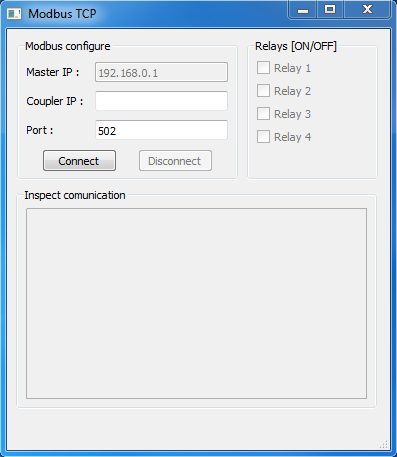
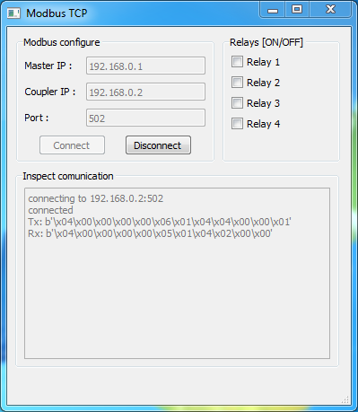
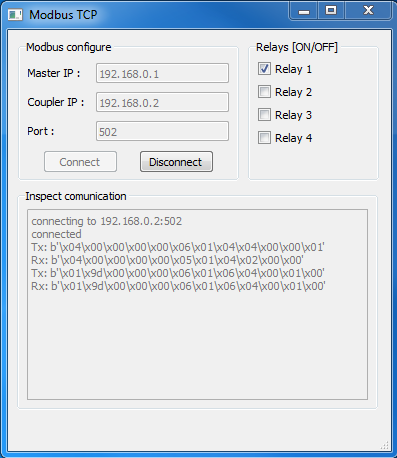

# About the project

**Modbus_TCP** is application made with python using:
- PySide2 for creating gui
- pynt for build proccess

This application communicates with TCP coupler through
modbus communication protocol.  

# Prerequisites:
- coupler and PC needs to be powered and connected 
with etherent cable
- you need to know couplers IP address and port
- coupler need to be connected to relay module 
(can be used with digital output module also)

# Usage
#### Connecting
Enter coupler IP address and port
Application will check all provaided data and if 
data is valid will connect to coupler 

#### Controling relay
Using check boxes control relay states  

#### Disconnecting
After you disconnect and close app relay states will remain
same. When you reopen **Modbus_TCP** and reconnect check boxes will
update with current relay values.
